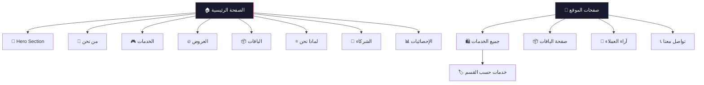

<div align="center">

<!-- Animated SVG Header Banner -->
<a href="https://ivxiq.com">

</a>

<!-- Typing Animation -->
<a href="https://ivxiq.com">

</a>

<br/>

<!-- Badges Row -->


<br/><br/>

<!-- Live Preview & Status -->
<a href="https://ivxiq.com"></a>
&nbsp;

&nbsp;


<br/><br/>

<!-- Divider -->


</div>

<br/>

## 🌟 نظرة عامة

> **IVX Store** هو متجر إلكتروني احترافي متكامل لبيع الخدمات الرقمية والاشتراكات في العراق. مبني بأحدث التقنيات مع تصميم عصري فاخر وتجربة مستخدم ممتازة تشمل رسوم متحركة سلسة، وضع مظلم أنيق، ودعم كامل للغة العربية (RTL).

<div align="center">
<table>
<tr>
<td align="center" width="140">
<br/>
<b>ألعاب</b>
</td>
<td align="center" width="140">
<br/>
<b>اشتراكات</b>
</td>
<td align="center" width="140">
<br/>
<b>حسابات</b>
</td>
<td align="center" width="140">
<br/>
<b>عروض</b>
</td>
<td align="center" width="140">
<br/>
<b>شحن رصيد</b>
</td>
</tr>
</table>
</div>

<br/>

---

## ✨ المميزات الرئيسية

<table>
<tr>
<td>🎨</td>
<td><b>تصميم عصري فاخر</b></td>
<td>واجهات Dark Mode مع تأثيرات Glassmorphism و Gradients متطورة</td>
</tr>
<tr>
<td>🚀</td>
<td><b>أداء فائق السرعة</b></td>
<td>تحسين تلقائي للأجهزة منخفضة الأداء مع Lazy Loading ذكي</td>
</tr>
<tr>
<td>🎬</td>
<td><b>رسوم متحركة سلسة</b></td>
<td>انتقالات ورسوميات Motion مذهلة مع تفاعل حي</td>
</tr>
<tr>
<td>📱</td>
<td><b>متجاوب بالكامل</b></td>
<td>تجربة ممتازة على جميع الأجهزة (موبايل، تابلت، ديسكتوب)</td>
</tr>
<tr>
<td>🌐</td>
<td><b>دعم RTL كامل</b></td>
<td>دعم كامل للغة العربية مع خطوط عربية مخصصة</td>
</tr>
<tr>
<td>💰</td>
<td><b>تحويل العملات</b></td>
<td>محوّل عملات ديناميكي مع دعم الدينار العراقي والدولار</td>
</tr>
<tr>
<td>🔒</td>
<td><b>مصادقة آمنة</b></td>
<td>تسجيل دخول عبر Google و البريد الإلكتروني باستخدام Firebase Auth</td>
</tr>
<tr>
<td>🛒</td>
<td><b>سلة مشتريات متقدمة</b></td>
<td>نظام تسعير ديناميكي مع خيارات مخصصة للكل خدمة</td>
</tr>
<tr>
<td>❤️</td>
<td><b>قائمة المفضلة</b></td>
<td>حفظ الخدمات المفضلة والوصول إليها بسهولة</td>
</tr>
<tr>
<td>🎯</td>
<td><b>SEO محسّن</b></td>
<td>عناوين وأوصاف ديناميكية لكل صفحة لتحسين الظهور</td>
</tr>
<tr>
<td>🖱️</td>
<td><b>مؤشر مخصص</b></td>
<td>مؤشر ماوس مخصص تفاعلي يضيف لمسة إبداعية</td>
</tr>
<tr>
<td>⚡</td>
<td><b>تسعير ديناميكي</b></td>
<td>نظام أسعار متقدم يدعم الباقات والعروض والكميات</td>
</tr>
</table>

<br/>

---

## 🗺️ أقسام الموقع

<div align="center">



</div>

### 🏠 الصفحة الرئيسية
| القسم | الوصف |
|-------|-------|
| **Hero Section** | عرض بطولي مع شعار IVX متحرك ونصوص متبدلة ديناميكياً |
| **من نحن** | بطاقات تفاعلية مكدسة (Stack Cards) بنقر للتبديل مع رسوم انتقالية |
| **الخدمات** | عرض شبكي للخدمات مع صور وأسعار وتصنيفات حسب الأقسام |
| **خدماتنا** | عرض أبرز الخدمات المتوفرة مع تفاصيل سريعة |
| **العروض الحصرية** | عرض العروض والتخفيضات المحدودة بتصميم جذاب |
| **الباقات** | عرض الباقات المميزة بأسعار تنافسية |
| **لماذا تختار IVX** | 6 مميزات أساسية (ضمان، تسليم فوري، دعم، منتجات أصلية...) |
| **الشركاء** | عرض شعارات الشركاء والعلامات التجارية الموثوقة |
| **الإحصائيات** | أرقام ديناميكية تعرض إنجازات المتجر (عملاء، طلبات...) |

### 📄 الصفحات الفرعية
| الصفحة | المسار | الوصف |
|--------|--------|-------|
| **جميع الخدمات** | `/services` | تصفح وتصفية جميع الخدمات مع بحث وترتيب |
| **خدمات القسم** | `/services/category/:id` | عرض خدمات قسم محدد |
| **الباقات** | `/packages` | عرض تفصيلي لجميع الباقات المتاحة |
| **آراء العملاء** | `/clients` | تقييمات وآراء العملاء السابقين |
| **تواصل معنا** | `/contact` | نموذج تواصل + معلومات الاتصال + روابط التواصل الاجتماعي |

<br/>

---

## 🛠️ التقنيات المستخدمة

<div align="center">

| التقنية | الإصدار | الاستخدام |
|---------|---------|-----------|
|  **React** | `19.0.0` | بناء واجهات المستخدم التفاعلية |
|  **TypeScript** | `5.8.2` | كتابة أكواد آمنة النوع |
|  **Tailwind CSS** | `4.1.14` | تنسيق سريع ومتجاوب |
| 🔥 **Firebase** | `12.12.0` | قاعدة بيانات وتوثيق ومصادقة |
| ⚡ **Vite** | `6.2.0` | أداة بناء فائقة السرعة |
| 🎬 **Motion** | `12.23.24` | رسوم متحركة سلسة واحترافية |
| 🧭 **React Router** | `7.13.2` | توجيه المسارات وانتقالات الصفحات |
| 📊 **Recharts** | `3.8.1` | رسوم بيانية ديناميكية للإحصائيات |
| 🎨 **Lucide React** | `0.546.0` | أيقونات SVG عصرية وخفيفة |
| 🔗 **clsx + tailwind-merge** | أحدث | إدارة ذكية لأسماء الأنماط |

</div>

<br/>

---

## 🏗️ هيكلية المشروع

```
ivx-store/
├── 📄 index.html                 # نقطة الدخول الرئيسية
├── 📦 package.json               # إعدادات المشروع والحزم
├── ⚙️ vite.config.ts             # إعدادات Vite
├── 📝 tsconfig.json              # إعدادات TypeScript
│
├── 🌐 public/                    # الملفات الثابتة
│
└── 📂 src/
    ├── 🚀 main.tsx               # نقطة تشغيل التطبيق
    ├── 🧩 App.tsx                # المكوّن الرئيسي والتوجيه
    ├── 🎨 index.css              # الأنماط العامة
    ├── 🎨 admin.css              # أنماط لوحة التحكم
    ├── 🌱 seed.ts                # بيانات أولية للتطوير
    │
    ├── 📂 components/            # المكوّنات القابلة لإعادة الاستخدام
    │   ├── 🎯 Hero.tsx               # قسم البطل الرئيسي
    │   ├── 📖 AboutUs.tsx            # من نحن (بطاقات تفاعلية)
    │   ├── 🎮 Services.tsx           # عرض الخدمات
    │   ├── 🛒 OurServices.tsx        # خدماتنا المميزة
    │   ├── 🔥 OffersSection.tsx      # العروض الحصرية
    │   ├── 📦 Packages.tsx           # الباقات
    │   ├── ⭐ WhyChooseUs.tsx        # لماذا نحن
    │   ├── 🤝 PartnersSection.tsx    # الشركاء
    │   ├── 📊 DataSection.tsx        # الإحصائيات
    │   ├── 👥 Clients.tsx            # آراء العملاء
    │   ├── 📞 Contact.tsx            # نموذج التواصل
    │   ├── 🎨 AnimatedIvxLogo.tsx    # شعار IVX المتحرك
    │   ├── 📱 Header.tsx             # شريط التنقل العلوي
    │   ├── 🔻 Footer.tsx             # التذييل
    │   ├── 📱 MobileNav.tsx          # قائمة الموبايل
    │   ├── 🛒 CartModal.tsx          # سلة المشتريات
    │   ├── ❤️ FavoritesModal.tsx     # المفضلة
    │   ├── 📋 OrderModal.tsx         # نموذج الطلب
    │   ├── 🔍 ServiceDetailsModal.tsx # تفاصيل الخدمة
    │   ├── 👤 UserAuthModal.tsx      # تسجيل الدخول
    │   ├── 👤 AccountModal.tsx       # الحساب الشخصي
    │   ├── 💱 CurrencySwitcher.tsx   # محوّل العملات
    │   ├── 💱 CurrencyModal.tsx      # نافذة اختيار العملة
    │   ├── 🌐 SocialIcons.tsx        # أيقونات التواصل الاجتماعي
    │   ├── 🖱️ CustomCursor.tsx       # مؤشر الماوس المخصص
    │   ├── ⏳ LoadingScreen.tsx      # شاشة التحميل
    │   ├── 🔝 ScrollToTop.tsx        # العودة للأعلى
    │   ├── 🔍 SeoHead.tsx            # عناوين SEO
    │   └── 📂 admin/                 # مكوّنات لوحة التحكم
    │
    ├── 📂 pages/                 # صفحات الموقع
    │   ├── 🏠 Home.tsx               # الصفحة الرئيسية
    │   ├── 🛍️ ServicesPage.tsx       # صفحة الخدمات
    │   ├── 🏷️ CategoryServicesPage.tsx # خدمات القسم
    │   ├── 📦 PackagesPage.tsx       # صفحة الباقات
    │   ├── 👥 ClientsPage.tsx        # صفحة العملاء
    │   ├── 📞 ContactPage.tsx        # صفحة التواصل
    │   └── ❌ NotFoundPage.tsx       # صفحة 404
    │
    └── 📂 lib/                   # المكتبات والأدوات
        ├── 🔥 firebase.ts            # إعدادات Firebase
        ├── ⚙️ SettingsContext.tsx     # سياق الإعدادات العامة
        ├── 💱 CurrencyContext.tsx     # سياق العملة
        └── 📱 useDevicePerformance.ts # كشف أداء الجهاز
```

<br/>

---

## 🎯 المميزات التقنية المتقدمة

<details>
<summary>🎨 <b>نظام التصميم</b></summary>
<br/>

- **Dark Mode** كامل مع تدرجات لونية متناسقة
- **Glassmorphism** مع `backdrop-blur` محسّن للأداء
- **خلفيات متحركة** مع تأثيرات Grid و Radial Gradient
- **تأثيرات Hover** تفاعلية على جميع البطاقات والأزرار
- **تجاوب ذكي** مع أحجام خطوط وتباعد مختلف لكل شاشة
</details>

<details>
<summary>⚡ <b>تحسين الأداء</b></summary>
<br/>

- **Lazy Loading** للمكوّنات الثقيلة (مثل Recharts)
- **كشف أداء الجهاز** وتبسيط التأثيرات تلقائياً للأجهزة الضعيفة
- **`transform-gpu`** و **`will-change-transform`** لرسوم متحركة سلسة
- **`content-auto`** لتحسين تقديم المحتوى خارج الشاشة
- **تقليل Backdrop Blur** تلقائياً على الأجهزة المحمولة
</details>

<details>
<summary>🔐 <b>نظام المصادقة والحماية</b></summary>
<br/>

- تسجيل دخول عبر **Google** و **البريد الإلكتروني**
- نظام **حظر المستخدمين** مع شاشة تنبيه
- **تتبع التواجد** (Presence Tracking) للزوار والمستخدمين
- **نبضات قلب** منتظمة كل 30 ثانية لتتبع الجلسات
</details>

<details>
<summary>💰 <b>نظام التسعير الديناميكي</b></summary>
<br/>

- أسعار **قابلة للتخصيص** لكل خدمة مع خيارات متعددة
- دعم **الباقات** و**العروض** و**الكميات**
- وضع التسعير: **استبدال** أو **إضافة** على السعر الأساسي
- **محوّل عملات** فوري مع دعم الدينار العراقي
</details>

<details>
<summary>📱 <b>التجاوب والموبايل</b></summary>
<br/>

- تصميم **Mobile-First** مع قوائم وشريط تنقل مخصص
- **بطاقات خدمات** بعمود واحد على الموبايل مع صور كاملة
- **لوحة مفاتيح مخصصة** للهاتف عند إدخال الأرقام
- **تعطيل المؤشر المخصص** على شاشات اللمس
</details>

<br/>

---

## 🚀 كيفية تشغيل المشروع محلياً

### المتطلبات الأساسية

| الأداة | الإصدار المطلوب |
|--------|----------------|
| **Node.js** | `v18.0.0` أو أحدث |
| **npm** | `v9.0.0` أو أحدث |

### خطوات التشغيل

```bash
# 1️⃣ استنساخ المستودع
git clone https://github.com/YOUR_USERNAME/ivx-store.git

# 2️⃣ الانتقال إلى المجلد
cd ivx-store

# 3️⃣ تثبيت الحزم المطلوبة
npm install

# 4️⃣ تشغيل خادم التطوير
npm run dev
```

> سيعمل الخادم على `http://localhost:3000` ويمكن الوصول إليه من أي جهاز على الشبكة عبر `http://YOUR_IP:3000`

### الأوامر المتاحة

| الأمر | الوصف |
|-------|-------|
| `npm run dev` | 🚀 تشغيل خادم التطوير (المنفذ 3000) |
| `npm run build` | 📦 بناء نسخة الإنتاج |
| `npm run preview` | 👀 معاينة نسخة الإنتاج |
| `npm run lint` | 🔍 فحص الأنواع مع TypeScript |
| `npm run clean` | 🧹 حذف مجلد dist |

<br/>

---

## 🌐 عرض الموقع المباشر

<div align="center">

<a href="https://ivxiq.com">

</a>

<br/><br/>

**🔗 https://ivxiq.com**

</div>

<br/>

---

## 👨‍💻 المطوّر

<div align="center">

<!-- Developer Profile Card -->


<br/>

<table>
<tr>
<td align="center" width="200">

</td>
<td>

### محمد حازم احمد

**مطوّر ويب متكامل | Full-Stack Developer**

تم تصميم وبرمجة هذا النظام بشغف وإتقان باستخدام أحدث التقنيات مع واجهات تفاعلية سريعة ومتقدمة مبنية بدقة واحترافية عالية.

<a href="https://t.me/dagg_iq"></a>
<a href="https://wa.me/9647771821250"></a>
<a href="https://www.instagram.com/dagg_iq"></a>

</td>
</tr>
</table>

</div>

<br/>

---

<div align="center">


</div>